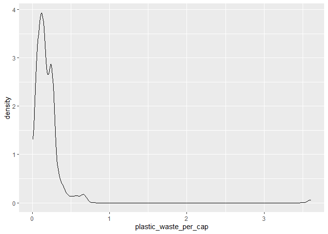
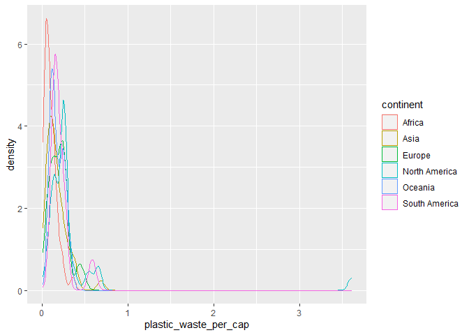
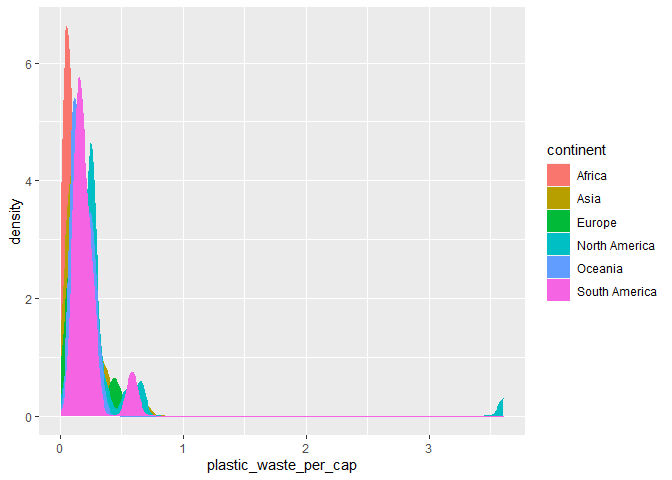
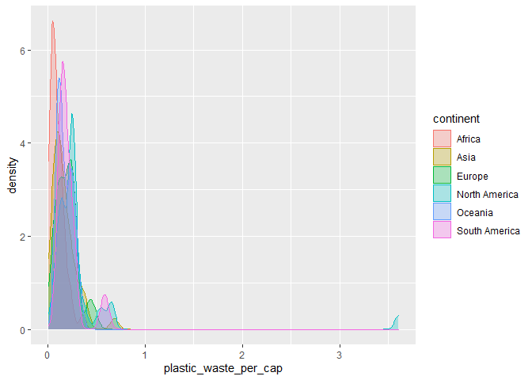
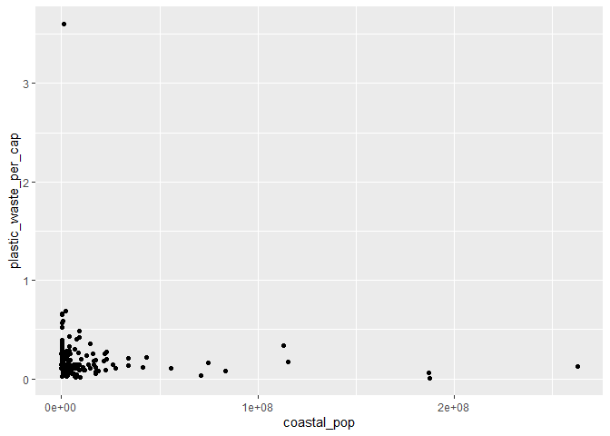

Lab 02 - Plastic waste
================
Annie Somerville
02.01.2021

## Load packages and data

``` r
library(tidyverse) 
```

``` r
plastic_waste <- read_csv("data/plastic-waste.csv")
glimpse (plastic_waste)
```

    ## Rows: 240
    ## Columns: 10
    ## $ code                             <chr> "AFG", "ALB", "DZA", "ASM", "AND",...
    ## $ entity                           <chr> "Afghanistan", "Albania", "Algeria...
    ## $ continent                        <chr> "Asia", "Europe", "Africa", "Ocean...
    ## $ year                             <dbl> 2010, 2010, 2010, 2010, 2010, 2010...
    ## $ gdp_per_cap                      <dbl> 1614.255, 9927.182, 12870.603, NA,...
    ## $ plastic_waste_per_cap            <dbl> NA, 0.069, 0.144, NA, NA, 0.062, 0...
    ## $ mismanaged_plastic_waste_per_cap <dbl> NA, 0.032, 0.086, NA, NA, 0.045, 0...
    ## $ mismanaged_plastic_waste         <dbl> NA, 29705, 520555, NA, NA, 62528, ...
    ## $ coastal_pop                      <dbl> NA, 2530533, 16556580, NA, NA, 379...
    ## $ total_pop                        <dbl> 31411743, 3204284, 35468208, 68420...

``` r
view (plastic_waste)
```

## Exercises

### Exercise 1

Most countries fall in the range of 0-1 kg/person, but Trinidad and
Tobago has the highest amount of plastic waste per capita at 3.6
kg/person.

``` r
ggplot(data = plastic_waste, aes(x = plastic_waste_per_cap)) +
  geom_histogram(binwidth = 0.2)
```

    ## Warning: Removed 51 rows containing non-finite values (stat_bin).

<!-- -->

``` r
plastic_waste %>%
  filter(plastic_waste_per_cap > 3.5)
```

    ## # A tibble: 1 x 10
    ##   code  entity continent  year gdp_per_cap plastic_waste_p~ mismanaged_plas~
    ##   <chr> <chr>  <chr>     <dbl>       <dbl>            <dbl>            <dbl>
    ## 1 TTO   Trini~ North Am~  2010      31261.              3.6             0.19
    ## # ... with 3 more variables: mismanaged_plastic_waste <dbl>, coastal_pop <dbl>,
    ## #   total_pop <dbl>

### Exercise 2

Color and fill were defined in (aes) because continent is part of the
source dataframe, thus it has to be included in (aes). Alpha is a
characteristic of the plotting geom instead of aesthetic because alpha
is not part of the source dataframe.

``` r
ggplot(data = plastic_waste, aes(x = plastic_waste_per_cap)) +
  geom_density()
```

    ## Warning: Removed 51 rows containing non-finite values (stat_density).

<!-- -->

``` r
ggplot(data = plastic_waste, 
       mapping = aes(x = plastic_waste_per_cap, 
                     color = continent)) +
  geom_density()
```

    ## Warning: Removed 51 rows containing non-finite values (stat_density).

<!-- -->

``` r
ggplot(data = plastic_waste, 
       mapping = aes(x = plastic_waste_per_cap, 
                     color = continent, 
                     fill = continent)) +
  geom_density()
```

    ## Warning: Removed 51 rows containing non-finite values (stat_density).

<!-- -->

``` r
ggplot(data = plastic_waste, 
       mapping = aes(x = plastic_waste_per_cap, 
                     color = continent, 
                     fill = continent)) +
  geom_density(alpha = 0.3)
```

    ## Warning: Removed 51 rows containing non-finite values (stat_density).

<!-- -->

### Exercise 3

``` r
ggplot(data = plastic_waste, 
       mapping = aes(x = continent, 
                     y = plastic_waste_per_cap)) +
  geom_boxplot()
```

    ## Warning: Removed 51 rows containing non-finite values (stat_boxplot).

<!-- -->

### Exercise 4

Boxplots and violin plots show means and distributions of plastic waste
per capita. It’s easier for me to see the individual points (or
countries) within continents on the boxplot compared to the violin plot,
and it’s easier for me to see the frequency (via density) of values on
the violin plot.

``` r
ggplot(data = plastic_waste, 
       mapping = aes(x = continent, 
                     y = plastic_waste_per_cap)) +
  geom_violin()
```

    ## Warning: Removed 51 rows containing non-finite values (stat_ydensity).

<!-- -->

### Exercise 5

I don’t see a clear relationship between plastic waste per capita and
mismanaged waste per capita - the relationship looks undefined.

``` r
ggplot(data = plastic_waste, 
       mapping = aes(x = plastic_waste_per_cap, 
                     y = mismanaged_plastic_waste_per_cap)) +
  geom_point()
```

    ## Warning: Removed 51 rows containing missing values (geom_point).

<!-- -->

### Exercise 6

There do seem to be clear distinctions between continents with respect
to the association between plastic waste per capita and mismanaged
plastic waste per captia. For example, it appears that Africa has a
strong positive linear association between the two (the slope is very
steep), whereas Europe’s positive linear association seems a bit weaker
(the slope is less steep).

``` r
ggplot(data = plastic_waste, 
       mapping = aes(x = plastic_waste_per_cap, 
                     y = mismanaged_plastic_waste_per_cap,
                     color = continent)) +
  geom_point()
```

    ## Warning: Removed 51 rows containing missing values (geom_point).

<!-- -->

### Exercise 7

It looks like total population and plastic waste per capita may have a
stronger linear relationship compared to coastal population and plastic
waste per capita.

``` r
ggplot(data = plastic_waste, 
       mapping = aes(x = total_pop, 
                     y = plastic_waste_per_cap)) +
  geom_point()
```

    ## Warning: Removed 61 rows containing missing values (geom_point).

<!-- -->

``` r
ggplot(data = plastic_waste, 
       mapping = aes(x = coastal_pop, 
                     y = plastic_waste_per_cap)) +
  geom_point()
```

    ## Warning: Removed 51 rows containing missing values (geom_point).

<!-- -->

### Exercise 8

Remove this text, and add your answer for Exercise 8 here.

``` r
# insert code here
```
