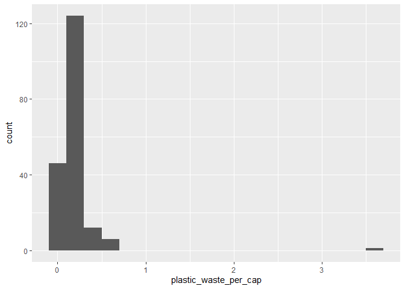

Lab 02 - Plastic waste
================
Annie Somerville
02.01.2021

## Load packages and data

``` r
library(tidyverse) 
```

``` r
plastic_waste <- read_csv("data/plastic-waste.csv")
glimpse (plastic_waste)
```

    ## Rows: 240
    ## Columns: 10
    ## $ code                             <chr> "AFG", "ALB", "DZA", "ASM", "AND",...
    ## $ entity                           <chr> "Afghanistan", "Albania", "Algeria...
    ## $ continent                        <chr> "Asia", "Europe", "Africa", "Ocean...
    ## $ year                             <dbl> 2010, 2010, 2010, 2010, 2010, 2010...
    ## $ gdp_per_cap                      <dbl> 1614.255, 9927.182, 12870.603, NA,...
    ## $ plastic_waste_per_cap            <dbl> NA, 0.069, 0.144, NA, NA, 0.062, 0...
    ## $ mismanaged_plastic_waste_per_cap <dbl> NA, 0.032, 0.086, NA, NA, 0.045, 0...
    ## $ mismanaged_plastic_waste         <dbl> NA, 29705, 520555, NA, NA, 62528, ...
    ## $ coastal_pop                      <dbl> NA, 2530533, 16556580, NA, NA, 379...
    ## $ total_pop                        <dbl> 31411743, 3204284, 35468208, 68420...

``` r
view (plastic_waste)
```

## Exercises

### Exercise 1

Most countries fall in the range of 0-1 kg/person, but Trinidad and
Tobago has the highest amount of plastic waste per capita at 3.6
kg/person.

``` r
ggplot(data = plastic_waste, aes(x = plastic_waste_per_cap)) +
  geom_histogram(binwidth = 0.2)
```

    ## Warning: Removed 51 rows containing non-finite values (stat_bin).

<!-- -->

``` r
plastic_waste %>%
  filter(plastic_waste_per_cap > 3.5)
```

    ## # A tibble: 1 x 10
    ##   code  entity continent  year gdp_per_cap plastic_waste_p~ mismanaged_plas~
    ##   <chr> <chr>  <chr>     <dbl>       <dbl>            <dbl>            <dbl>
    ## 1 TTO   Trini~ North Am~  2010      31261.              3.6             0.19
    ## # ... with 3 more variables: mismanaged_plastic_waste <dbl>, coastal_pop <dbl>,
    ## #   total_pop <dbl>

### Exercise 2

Color and fill were defined in (aes) because continent is part of the
source dataframe, thus it has to be included in (aes). Alpha is a
characteristic of the plotting geom instead of aesthetic because alpha
is not part of the source dataframe.

``` r
ggplot(data = plastic_waste, aes(x = plastic_waste_per_cap)) +
  geom_density()
```

    ## Warning: Removed 51 rows containing non-finite values (stat_density).

<!-- -->

``` r
ggplot(data = plastic_waste, 
       mapping = aes(x = plastic_waste_per_cap, 
                     color = continent)) +
  geom_density()
```

    ## Warning: Removed 51 rows containing non-finite values (stat_density).

<!-- -->

``` r
ggplot(data = plastic_waste, 
       mapping = aes(x = plastic_waste_per_cap, 
                     color = continent, 
                     fill = continent)) +
  geom_density()
```

    ## Warning: Removed 51 rows containing non-finite values (stat_density).

<!-- -->

``` r
ggplot(data = plastic_waste, 
       mapping = aes(x = plastic_waste_per_cap, 
                     color = continent, 
                     fill = continent)) +
  geom_density(alpha = 0.3)
```

    ## Warning: Removed 51 rows containing non-finite values (stat_density).

<!-- -->

### Exercise 3

``` r
ggplot(data = plastic_waste, 
       mapping = aes(x = continent, 
                     y = plastic_waste_per_cap)) +
  geom_boxplot()
```

    ## Warning: Removed 51 rows containing non-finite values (stat_boxplot).

<!-- -->

### Exercise 4

Boxplots and violin plots show means and distributions of plastic waste
per capita. It’s easier for me to see the individual points (or
countries) within continents on the boxplot compared to the violin plot,
and it’s easier for me to see the frequency (via density) of values on
the violin plot.

``` r
ggplot(data = plastic_waste, 
       mapping = aes(x = continent, 
                     y = plastic_waste_per_cap)) +
  geom_violin()
```

    ## Warning: Removed 51 rows containing non-finite values (stat_ydensity).

<!-- -->

### Exercise 5

I don’t see a clear relationship between plastic waste per capita and
mismanaged waste per capita - the relationship looks undefined.

``` r
ggplot(data = plastic_waste, 
       mapping = aes(x = plastic_waste_per_cap, 
                     y = mismanaged_plastic_waste_per_cap)) +
  geom_point()
```

    ## Warning: Removed 51 rows containing missing values (geom_point).

<!-- -->

### Exercise 6

Remove this text, and add your answer for Exercise 6 here.

``` r
# insert code here
```

### Exercise 7

Remove this text, and add your answer for Exercise 7 here.

``` r
# insert code here
```

``` r
# insert code here
```

### Exercise 8

Remove this text, and add your answer for Exercise 8 here.

``` r
# insert code here
```
